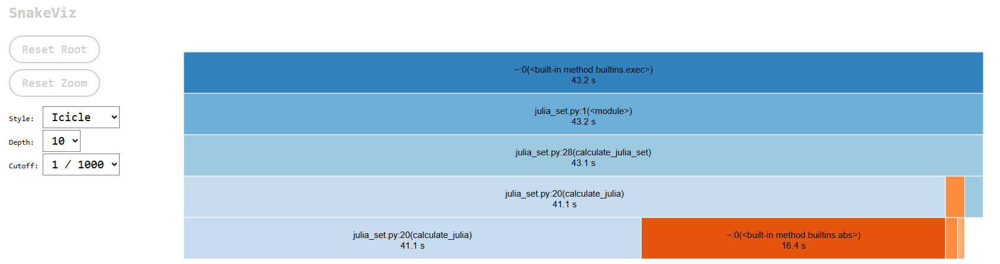
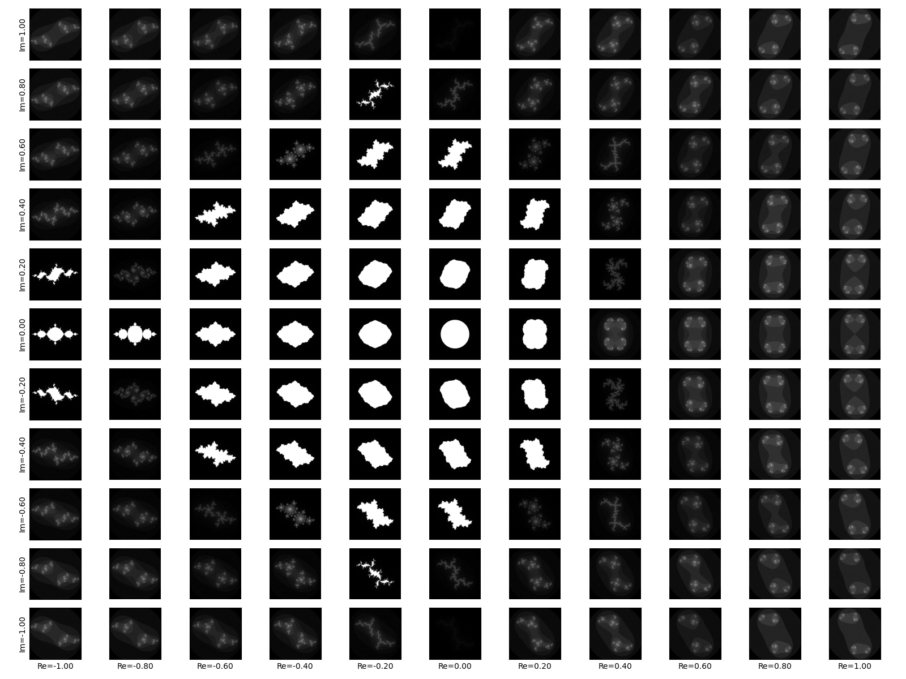

# Intro

I've been interested in Python programming for 7 years now. At first, I started to learn it to find some internships. My first internship was at Samsung, creating deep learning models for emoji prediction. 
To take my Python knowledge to the next level, I consumed the "Python3: Deep Dive: Part 1 - Functional" course by Dr. Fred Baptiste on [udemy](https://www.udemy.com/course/python-3-deep-dive-part-1/).
This made me understand Python on a much deeper level. Alongside working on a daily basis, I continued learning about Python from these courses.

Now, it is time to dig deeper. I want to understand the performance of Python code and what it actually does under the hood.

# Code problems
There are two main problems we will be focusing on:
* Creating a Julia set
* Solving a diffusion equation

These are simple, but very interesting numerical algorithms. They will allow us to demostrate the performance issues we may face.

# Julia Set

We are going to benchmark a few optimizations we can perform. First, let's look at the raw python version from `src/julia_set.py`.

We can clearly see, that the biggest bottlenck is the python code of `calculate_julia`. Even though it doesn't do much work (iterates in
a loop at most 300 times), computes the magnitude of complex numbers and squares them, it is being executed for every item in a 1000x1000 grid.
Thus, speeding up this function will have a great impact on the speed of execution of the whole program.

The average time of 5 for performing the operation is 2.99, however it may vary depending on the run.
Compiling it with Cython (without any changes to the code) immediately drops the time down to 0.67 average of 5.
Adding type definition to the `calculate_julia` function results in further improvement to 0.35 seconds average of 5.

Because we improved the performance of the function over 10x, it takes now only 30 seconds
to run experiments on a grid of 11x11 parameter values to explore how does the Julia set
behave for various c's.

In next steps, we will explorethe implementation of the whole function directly in C++ with Python bindings. This will allow us to test
if using Cython involves any additional overhead. Also, since the task is highly parallel, we can exploring using multiple threads
for calculating each value in the grid.

